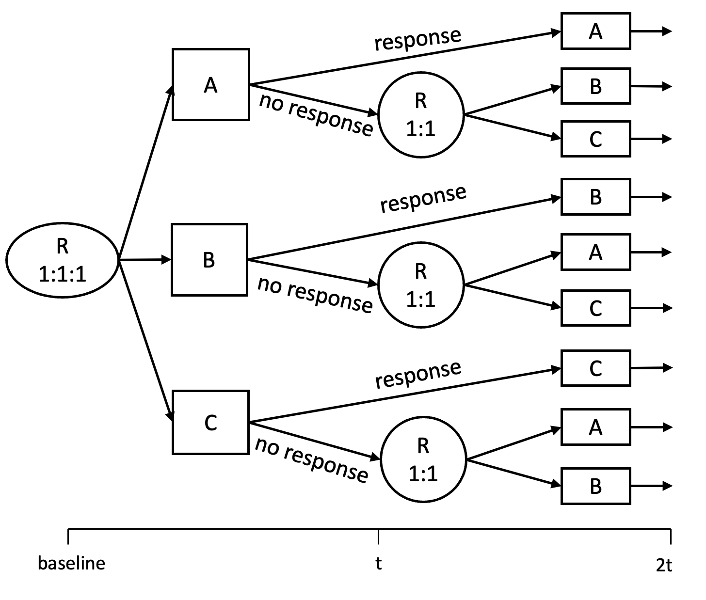
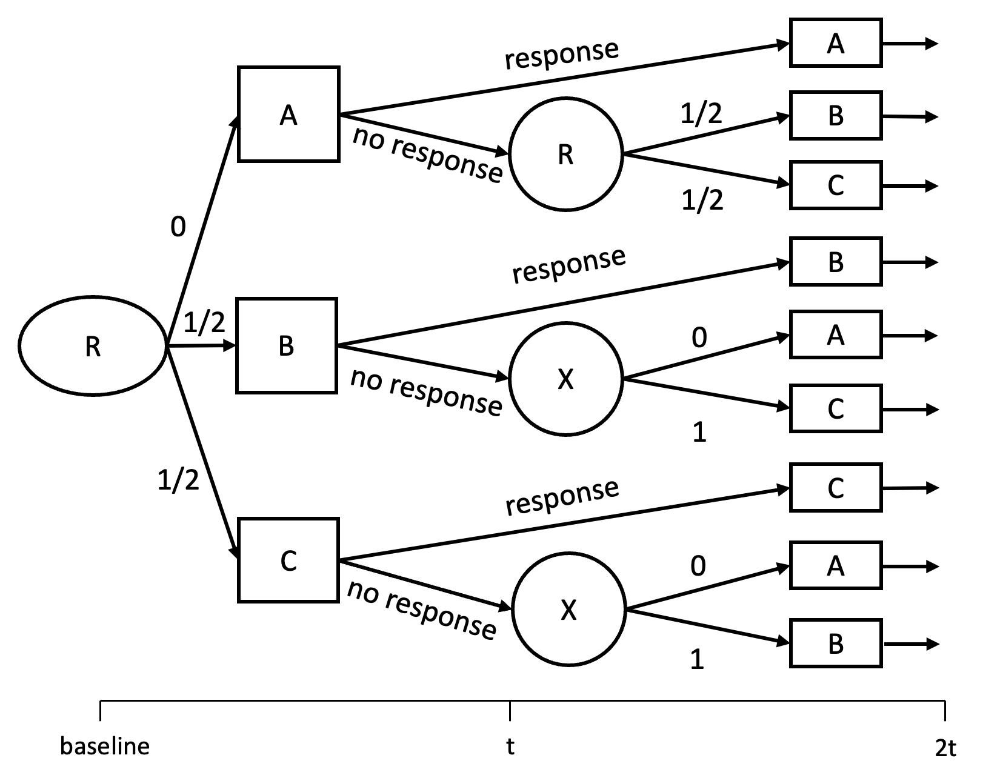
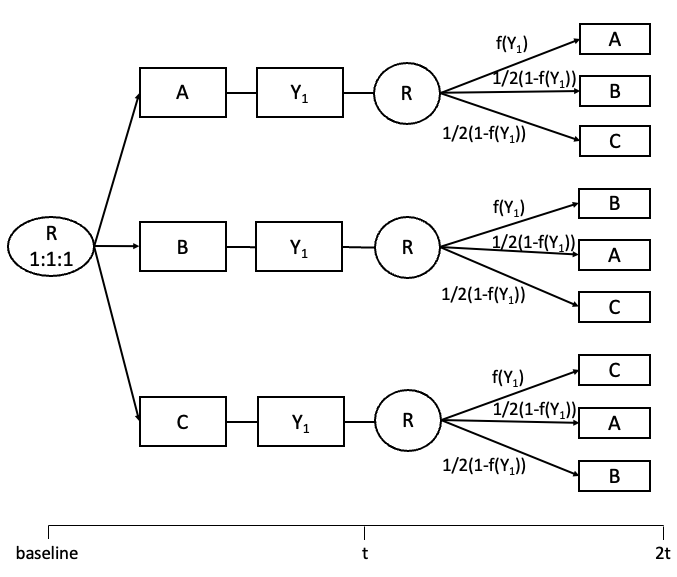

# Summary

Small sample, sequential, multiple assignment, randomized trials (snSMARTs) are multistage trials with the primary goal of estimating treatment effects. Participants are first randomized to one of the first stage treatments, then participants may be re-randomized in the second stage depending on their outcome or response to first stage treatment. In an snSMART, treatment effects in the first stage are estimated using data from both stages, which results in more precise estimates. The design of the snSMART may also help to improve participant recruitment and retention over standard rare disease designs. In the past few years, substantial progress has been made regarding the development of statistical methods for snSMART designs. To better facilitate the application of these statistical methods, we introduce the R package snSMART in this paper, which can be used to analyze data from an existing snSMART design or aid in the design and sample size of an snSMART.

# Introduction

A randomized, controlled clinical trial (RCT) is generally considered to be the most rigorous way of estimating the efficacy or effectiveness of treatments [@grimes2002overview]. It can be challenging to conduct RCTs when the number of individuals affected is small. Traditional methods such as crossover and N-of-1 trials focus on treatment efficacy in small samples. However, these methods have limitations restricting their use and suffer from recruitment and retention problems. 

As a novel approach to study treatments in small samples, snSMART, or small sample, sequential, multiple assignment, randomized trial, designs and methods have been developed in recent years. Motivated by A Randomized Multicenter Study for Isolated Skin Vasculitis [@micheletti2020protocol], the design and methods of snSMARTs generally apply to any disorder or disease that affects a small group of people and remains stable over the duration of the trial. Similar to a classic sequential, multiple assignment, randomized trial (SMART) design [@lavori2000design; @murphy2005experimental], a two-stage snSMART design first randomizes all participants to one of the first-stage treatments, then conducts second stage randomization based on its first stage treatment outcome (see Figure \@autoref(fig:snSMART-standard)). However, the snSMART design differs from a classic SMART design in that an snSMART design measures the same treatment outcome at the end of both the first and second stage, with the time length of both stages being equal. These requirements are not necessary for a classic SMART design. Further, the goal of an snSMART is to identify the superior first stage treatment using data from both stages, which is substantially different from a SMART's goal of identifying an effective personalized two-stage treatment sequence or dynamic treatment regimen (DTR). An snSMART design repeats the same first stage treatments in the second stage of the trial, and may allow responders to the first stage treatment to stay on that same treatment in the second stage. Thus, the snSMART design allows for the estimation of first stage treatment effects by utilizing data from both stages, which is helpful for achieving more precise estimates. Given the three aspects listed above and the rare disease setting, an snSMART design will have a smaller sample size and be less flexible than a classic SMART design, and therefore requires a different set of analytic methods from those developed for analyzing data from a classic SMART.

In the past few years, substantial progress has been made regarding the development of statistical methods for analyzing trial data from the following snSMART designs: an snSMART with three active treatments [@wei2018bayesian; @wei2020sample; @chao2020dynamic], a group sequential snSMART with three active treatments [@chao2020bayesian], an snSMART with placebo and two dose levels of one treatment [@fang2021bayesian], and an snSMART with continuous outcomes [@hartman2021design]. However, there is a lack of statistical software to disseminate the methods. Our R package `snSMART` fills this gap by providing functions for calculating the required sample size for an snSMART with three active treatments, and analyzing trial data using both Bayesian and frequentist approaches. To the extent of our knowledge, there are no existing R packages that provide similar functions. 

We first describe the notation and models of different snSMART designs implemented in the package `snSMART` in Section 2. Section 3 illustrates the application of `snSMART` to simulate and analyze trial data. Section 4 concludes with a brief summary and potential future work on this package.




# Statistical methods for snSMART designs 

## snSMART with binary outcomes and 3 active treatments (3AT) {#sec:bjsm}

The first proposed snSMART design (see Figure \@autoref(fig:snSMART-standard)), or snSMART with three active treatments, was used to design the trial ARAMIS [@micheletti2020protocol]. In this design, participants are equally randomized among three active treatments ("trtA", "trtB", and "trtC") in the first stage. After a set period of time that is sufficient for the treatment effects to be realized, a binary response to the first stage treatment is assessed. In the second stage, responders to the initial treatment stay on that same treatment, while non-responders are equally re-randomized to one of the other two treatments that they did not receive in the first stage. After the same amount of time as the first stage, the same binary response is measured at the end of the second stage. To analyze data from this design, @wei2018bayesian developed a Bayesian joint stage model (BJSM) that borrows information across both stages and estimates the effects of first stage treatments along with their pairwise differences with corresponding credible intervals.

The BJSM is specified as follows:

\begin{equation}
Y_{i1m}|\pi_m \sim Bernoulli(\pi_m) \label{eq:1}
\end{equation}
\begin{equation}
Y_{i2m'}|Y_{i1m}, \pi_{m'}, \beta_{1m}, \beta_{0m} \sim Bernoulli((\beta_{1m}\pi_{m})^{Y_{i1m}}(\beta_{0m}\pi_{m'})^{1-Y_{i1m}}) \label{eq:2}
\end{equation}
for $i = 1,...,N$; $m, m' = A, B, C$; and $j = 1, 2$; where 
$Y_{ijm}$ is the outcome for participant $i$ at stage $j$ for treatment $m$ and takes the value 1 for response to treatment and 0 for no response; 
$N$ is the total sample size;
$\beta_{0m}$ and $\beta_{1m}$ are the linkage parameters for non-responders and responders, respectively;
$\pi_m$ is the first stage response rate for treatment $m$;
$\beta_{1m}\pi_{m}$ is the second stage response rate for first stage responders; and 
$\beta_{0m}\pi_{m'}$ is the second stage response rate for non-responders to treatment $m$ in the first stage who receive treatment $m'$ in the second stage. 
Prior distributions for parameters $\pi_m, \beta_{0m}$, and $\beta_{1m}$ are user-specified based on expert knowledge and/or prior studies. For the ARAMIS trial, @wei2018bayesian specifies $\pi_m \sim Beta(0.4, 1.6)$, $\beta_{0m} \sim Beta(1, 1)$ and $\beta_{1m} \sim Pareto(1, 3)$, but more flexible prior distributions for the linkage parameters are given for the snSMART comparing two dose levels with placebo.  The posterior distribution of $\pi_m$ is obtained by using Markov chain Monte Carlo (MCMC) sampling.

When estimating first stage treatment effects, a parsimonious BJSM model ("two beta model") was recommended where $\beta_{0m}=\beta_0$ and $\beta_{1m}=\beta_1$ for all $m$ so that the linkage parameters do not depend on the initial treatment $m$. @wei2018bayesian showed that first stage treatment effect estimates remained mostly unbiased and efficient even if this assumption was not true.   

Dynamic treatment regimens (DTRs), evidence-based clinical guidelines for stage I and stage II treatments that may depend on the response to the initial treatment, are embedded within an snSMART design [@chao2020dynamic]. While we do not anticipate the construction of DTRs to motivate an snSMART design like they do a classic SMART, if the disease is not as stable as predicted or there is not an adequate washout period between the stages, DTRs can be estimated. Here, the response rate of each DTR is specified as $\pi_{mmm'}$, where $m = A, B, C$, $m' = A, B, C$ and $m' \ne m$. $m$ is the stage 1 treatment and the stage 2 treatment for stage 1 responders, and $m'$ is the stage 2 treatment for stage 1 non-responders.  Each DTR is denoted by a treatment triplet, for example, AAB specifies the guideline of first treating with A and continuing with A for stage 1 responders, while switching to B for stage 1 non-responders. When analyzing DTRs, we use the BJSM with six linkage parameters to allow the linkage parameters to vary with first stage treatment (Equation \@autoref(eq:2)). Then, we use the following equation to calculate the response rate for each DTR as:

$$\pi_{mmm'} = \pi_m(\pi_m\beta_{1m}) + (1 - \pi_m)(\pi_{m'}\beta_{0m}).$$
@wei2020sample and @chao2020dynamic proposed the Log-linear Poisson Joint Stage Model (LPJSM) as a frequentist alternative to estimate treatment effects using the pooled data from a two-stage snSMART. This model deploys a log link to model the mean and a Poisson family variance structure to model the variability of data. The LPJSM is specified as:

\begin{equation}
\log(E(Y_{i1m}))=\log(\mu_{i1m})=\alpha_A \mathbf{1}\{ m=A \} + \alpha_B\mathbf{1}\{ m = B \} + \alpha_C\mathbf{1}\{ m=C \} \label{eq:LPJSM}
\end{equation}
$$
\begin{aligned}
\log(E(Y_{i2m'}))=\log(\mu_{i2m'})=\alpha_A & \mathbf{1}\{m'=A\} + \alpha_B\mathbf{1}\{m'=B\}+\alpha_C\mathbf{1}\{ m'=C \}+ \\
&\gamma_{1m}\mathbf{1}\{ Y_{i1m}=1 \} +\gamma_{0m}\mathbf{1}\{Y_{i1m}=0 \} 
\end{aligned}
$$
where $\mathbf{1}\{\cdot\}$ is an indicator function. The exponentiated $\alpha_{m}, \gamma_{0m}$ and $\gamma_{1m}$ map 1:1 to $\pi_m$ and the linkage parameters $\beta_{1m}$ and $\beta_{0m}$ as specified in eqs. \@autoref(eq:1)-\@autoref(eq:2). Similarly, a more parsimonious LPJSM can be used when estimating first stage treatment effects where $\gamma_{1m}=\gamma_{1}$ and $\gamma_{0m}=\gamma_{0}$. The parameters are estimated using generalized estimating equations (GEE) [@zeger1986longitudinal] with an independence working correlation structure. A robust "sandwich" estimator is used to estimate the variance of the parameters. 

Based on asymptotic approximations, @wei2020sample proposed an algorithm that assumes the "two beta model" and uses the average coverage criterion (ACC) [@adcock1988bayesian] to calculate the sample size of an snSMART:

\begin{equation}
1 - 2\Phi\left(-\frac{\ell}{2\sqrt{Var(\mathcal{D}})}\right) = 1 - \alpha \label{eq:3}
\end{equation}
where $1 - \alpha$ is the expected coverage rate; $\mathcal{D} = \pi_{(1)} - \pi_{(2)}$, $\pi_{(1)}$ is the highest response rate among three treatments, $\pi_{(2)}$ is the second highest response rate among three treatments; $\Phi(\cdot)$ is the probability density function of a standard normal distribution; and $\ell$ is a fixed length. The fixed length $\ell$ can be determined via a grid search when the user specifies $1 - \xi$ or the desired probability that the posterior credible interval of $\mathcal{D}$, the difference between the treatments with the highest and second highest response rates, excludes 0. This quantity, $1 - \xi$, is similar to statistical power and the desired coverage rate, $1 - \alpha$, is similar to one minus the type I error which users may be more familiar. The expected value for $\beta_0$ and $\beta_1$ are provided by the user based on expert opinion or prior data to approximate the posterior distribution of $\pi_m$. Under the ACC, the solution to Equation \@autoref(eq:3) is the sample size required for each arm in first stage of the trial. 

## Group sequential snSMART with binary outcomes

In a group sequential snSMART design, the snSMART with three active treatments is extended to allow for interim analyses so that the worst performing treatment arm can be dropped during the trial if supported by pre-determined rules [@chao2020bayesian]. If a treatment is deemed inferior or superior to the other treatments at a particular interim point, the treatment with the lowest estimated response rate is dropped. A group sequential snSMART begins as a standard snSMART (Figure \@autoref(fig:snSMART-standard)) with three active treatments where participants are randomized equally among first stage treatments, first stage responders continue their treatment, and first stage non-responders are randomized equally to the other treatment options not initially received. At one or two pre-determined interim decision points $l$, one treatment arm may be removed given the two-step decision rule specified below. If a treatment is dropped after an interim analysis, non-responders to this dropped first stage treatment arm are equally randomized to the other two treatments in the second stage, and responders to this dropped first stage treatment remain on this treatment in the second stage. First stage non-responders to each of the non-inferior treatments are switched (deterministically) to the other non-inferior treatment in the second stage. Participants enrolled after the removal of a treatment arm no longer receive the removed treatment in stage 1 (Figure \@autoref(fig:snSMART-group)). It is important to note that re-randomization is carried out solely at the conclusion of stage 1 for each participant rather than immediately after the interim analysis $l$.



Here we add to the notation as defined in Section \@autoref(sec:bjsm). At each interim look $l$, all of the available outcome data $Y_{i1m}$ and $Y_{i2m'}$ for all $m,m'\equiv A,B,C$ are used to calculate the posterior distributions of the response rates of each treatment.  In addition, $N_l$ is the sample size at each look, $P_{m,l} = P_l(\pi_m > \pi_{m'}$ for all $m' \ne m | data_l)$ is the interim posterior probability that treatment $m$ has the greatest response rate given the data up to look $l$, $Q_{m,l} = P_l(\pi_m < \pi_{m'}$ for all $m' \ne m | data_l)$ is the interim posterior probability that treatment $m$ has the lowest response rate given the data up to look $l$. The two-step decision rule at look $l$ is as follows:

1. Calculate $P_{m,l}$ for each treatment $m\equiv A,B,C$ and compare them with a prespecified cut-off $\tau_l$
2. If $P_{m,l} > \tau_l$ for any of the $m \equiv A,B,C$, then compute $Q_{m',l}$ for treatments $m' \ne m$ and remove the treatment with the higher $Q_{m',l}$; if $P_{m,l} \leq \tau_l$ for all $m \equiv A,B,C$, then compute $Q_{m,l}$ for all $m$ and compare the posterior probability $Q_{m,l}$ with the prespecified cut-off $\psi_l$. If $Q_{m,l}>\psi_l$ for any of the $m \equiv A,B,C$ then treatment $m$ will be removed. Otherwise, all treatments are kept in the trial. 

Here, $\tau_l$ and $\psi_l$ are tuning parameters used in the decision rules to maintain desired operating characteristics of the trial. These tuning parameters, $\tau_l$ and $\psi_l$, are selected through grid search simulations. 

## snSMART comparing two dose levels with placebo (P2D)
An snSMART design that investigates the response rate of one experimental treatment at low and high doses compared with placebo [@fang2021bayesian] is a variation of the snSMART design with three active treatments from Figure \@autoref(fig:snSMART-standard). In such an snSMART design (Figure \@autoref(fig:snSMART-dose)), participants are equally assigned to either receive placebo, low dose, or high dose in the first stage. Participants receive their initial treatment for a pre-specified amount of time until the measurement of their responses at the end of stage 1. In the second stage, all participants who received placebo or low dose in the first stage are re-randomized to either low or high dose regardless of their first stage response. Participants who responded to high dose are re-randomized between low and high dose, whereas those who did not respond to high dose receive high dose again in the second stage. The main goal of this snSMART is to estimate first stage low and high dose treatment response rates and compare them to placebo by modeling the pooled data from two stages.


@fang2021bayesian used the Bayesian joint stage model (BJSM) from @wei2018bayesian in Equations \@autoref(eq:1) and \@autoref(eq:2) with six linkage parameters that varied by first stage treatments. However, for this design $m = P, L, H$ and $m' = L, H$ where P = placebo, L = low dose and H = high dose and prior distributions of the treatment effects differed from that in @wei2018bayesian. The prior distribution for the response rate of placebo may be informed by natural history studies or previous trials and specified such that $\pi_P \sim Beta(\zeta_n, \eta_n)$. A weak tendency for the doses of the drug to have greater response rates than the effect of placebo can be assumed through $\log(\pi_L/\pi_P) \sim N(\mu, \sigma^2)$ and $\log(\pi_H/\pi_P) \sim N(\mu, \sigma^2)$. The prior distributions for the linkage parameters may vary with guidance of specifying $\beta_{0m}, \beta_{1m} \sim Gamma(\omega, \psi)$. As with the other designs and analytic methods, posterior samples are drawn through MCMC sampling.

Similarly, the log-linear Poisson joint stage model is specified in Equation \@autoref(eq:LPJSM) replacing A, B and C with P, L and H for placebo, low, and high dose.



## snSMART with continuous outcomes
The snSMART design and corresponding methods described above consider a binary endpoint measured at the end of the first and second stage. However, in many studies the outcome of interest may be a continuous variable. In such cases, @hartman2021design proposed a mapping function that maps the stage one outcome $Y_{i1}$ to a probability of staying on the same treatment (Figure \@autoref(fig:snSMART-continuous)). A higher probability indicates the observation of a better outcome, so that there is a better chance to remain on that treatment in the second stage. In this package, we formulate the mapping function as: 

$$f(Y_{i1}) =\left( \frac{Y_{i1} - Y_{min}}{Y_{max} - Y_{min}}\right) ^{s}$$
where $Y_{min}$ and $Y_{max}$ are the known minimum and maximum values of $Y_{i1}$. Researchers may consider different mapping functions to accommodate their studies by assuming various values of $s$ depending on the knowledge about the outcome. For example, assuming $0<s<1$ may be appropriate when one expects a majority of participants to stay on the same intervention in the second stage, or when the outcome may be right skewed. Conversely, having $s>1$ may be preferable when one expects poorer outcomes and desires higher chances for treatment switching, or when the outcome is likely left skewed. 

```r
library(knitr)
library(kableExtra)
df <- data.frame(
  Function = c(
    "**BJSM functions**", "``BJSM_binary``", "``BJSM_c``", "``group_seq``",
    "**Frequentist functions**", "``LPJSM_binary``",
    "**Sample size calculation**", "``sample_size``",
    "**``S3 summary`` and ``print`` methods**", "for class ``BJSM_binary``",
    "for class ``BJSM_binary_dose``", "for class ``BJSM_c``",
    "for class ``group_seq``", "for class ``LPJSM_binary``",
    "for class ``sim_group_seq``"
  ),
  Description = c(
    "", "BJSM binary (3AT or P2D snSMART)",
    "BJSM (3AT snSMART with a mapping function and continuous outcome)",
    "BJSM (interim analysis and final analysis of group sequential 3AT snSMART)",
    "", "LPJSM (3AT or P2D snSMART)",
    "", "3AT snSMART sample size calculation",
    "", "Summarize and print ``BJSM_binary`` object",
    "Summarize and print ``BJSM_binary_dose`` object",
    "Summarize and print ``BJSM_c`` object",
    "Summarize and print ``group_seq`` object",
    "Summarize and print ``LPJSM_binary`` object",
    "Summarize and print ``sim_group_seq`` object"
  )
)
kable(df,
  col.names = c("Function", "Description"), booktabs = T, escape = T, align = "l", format = "simple",
  label = "functionality", caption = "Summary of the functionality of the snSMART package"
)
```

```r
library(knitr)
library(kableExtra)
df <- data.frame(
  Function = c(
    "BJSM functions", "BJSM_binary", "BJSM_c", "group_seq",
    "Frequentist functions", "LPJSM_binary",
    "Sample size calculation", "sample_size",
    "S3 summary and print methods", "for class 'BJSM_binary'",
    "for class 'BJSM_binary_dose'", "for class 'BJSM_c'",
    "for class 'group_seq'", "for class 'LPJSM_binary'",
    "for class 'sim_group_seq'"
  ),
  Description = c(
    "", "BJSM binary (3AT or P2D snSMART)",
    "BJSM (3AT snSMART with a mapping function and continuous outcome)",
    "BJSM (interim analysis and final analysis of group sequential 3AT snSMART)",
    "", "LPJSM (3AT or P2D snSMART)",
    "", "3AT snSMART sample size calculation",
    "", "Summarize and print 'BJSM_binary' object",
    "Summarize and print 'BJSM_binary_dose' object",
    "Summarize and print 'BJSM_c' object",
    "Summarize and print 'group_seq' object",
    "Summarize and print 'LPJSM_binary' object",
    "Summarize and print 'sim_group_seq' object"
  )
)
kable(df,
  col.names = c("Function", "Description"), booktabs = T, escape = T, align = "l", format = "latex",
  label = "functionality", caption = "Summary of the functionality of the snSMART package"
) %>%
  kable_styling(font_size = 5.5, latex_options = "scale_down") %>%
  column_spec(2, width = "4.5cm") %>%
  row_spec(row = c(1, 5, 7, 9), bold = T, italic = T)
```

@hartman2021design assumed a multivariate normal likelihood for the observed data $(Y_{i1} ,Y_{i2})$ in an snSMART as below. 

$$F(x) = \begin{bmatrix} Y_{i1} \\ Y_{i2} 
       \end{bmatrix}\Bigg\vert  M_{i1}, M_{i2} 
       \sim MVN \left(  \begin{bmatrix} 
                        \mu_1(M_{i1}) \\ \mu_2(M_{i1}, M_{i2})
                        \end{bmatrix},
                        \boldsymbol{V}(M_{i1}, M_{i2}) 
                 \right),$$
where $Y_{ij}$ is a continuous outcome and $M_{ij}$ is the treatment for participant $i$ in stage $j$, $j = 1,2$. The first stage and second stage mean treatment effects are:

$$\mu_1(M_{i1}) = \sum_{m=A}^C\xi_mI(M_{i1} = m)$$
$$\mu_2(M_{i1},M_{i2})=\phi_1\sum_{m=A}^C\xi_mI(M_{i1}=m)+\phi_2\sum_{m'=A}^C\xi_{m'}I(M_{i2}=m')+\phi_3I(M_{i1}=M_{i2}).$$
Here, the $\xi_m$ parameters are the expected treatment effect of treatment $m$, $m = A, B, C$. $\phi_1$ is the lingering effect of the first treatment , $\phi_2$ is the additional effect of the second treatment, and $\phi_3$ is the cumulative effect that occurs on the treatment longer term if the participant stays on the same treatment in stage 2. The variance-covariance matrix is: 
$$V(M_{i1}, M_{i2})=V_1I(M_{i1} =M_{i2})+V_2I(M_{i1} \neq M_{i2}),$$ where $V_1$ and $V_2$ are both 2 × 2 variance-covariance matrices, which allows those who stay on the same treatment to have a different correlation between stage one and stage two outcomes than those who switch treatments.

@hartman2021design imposed a few constraints regarding the $\phi_m$ parameters: 1) $\phi_2 = 1 - \phi_1$, $\phi_1, \phi_2 > 0$, 2) $\phi_2 > \phi_1$ and 3) $\phi_3 \geq 0$. Besides the constraints used to facilitate the estimation, the prior distributions of the unknown parameters can be specified as: 

- $\xi_m \sim N(\mu, \sigma)$ for $m=1,2,3$
- $\phi_1 \sim Unif(0, 0.5)$
- $\phi_3 \sim FN(mean = 0, sd = \zeta)$ and
- $V_1, V_2 \sim IW_2\left( \begin{bmatrix} 1 & 0 \\ 0 & 1 \end{bmatrix}, 2 \right)$,

where $\mu$ and $\sigma$ are specified based on previous knowledge or expert opinion about the treatment effects of all agents. The uniform prior of $\phi_1$ ensures the constraints of $\phi_1$ and $\phi_2$. The folded normal (FN) prior distribution of $\phi_3$ ensures $\phi_3$ is positive. The covariance matrices $V_1, V_2$ jointly follow an inverse Wishart distribution that serves as a noninformative conjugate prior for multivariate normal covariances. 

# The `snSMART` package

The `snSMART` package can be downloaded from the Comprehensive R Archive Network (CRAN) at \url{https://cran.r-project.org/web/packages/snSMART/index.html}. Please install the \href{https://sourceforge.net/projects/mcmc-jags/}{JAGS library} [@plummer2003jags] before using this package. This package provides a sample size calculation and multiple methods of trial data analysis for various snSMART designs. A brief introduction of each snSMART design is provided in Section 2. We also summarized the functionality of all the `snSMART` functions in Table \@autoref(tab:functionality). The `snSMART` package includes the option to set the number of "adaptation iterations" in the functions that perform MCMC computation. This option aims to provide users with the complete functionality of the  ``jags.model`` function available in the `rjags` package [@rjags].

After installing package `snSMART`, load the package:

```r
library("snSMART")
```
We assume that we have data from an snSMART with three active treatments in a matrix with 4 columns: ``treatment_stageI, response_stageI, treatment_stageII``, and ``response_stageII``. The rows of the dataset correspond to each participant in the trial. For example, here we use a dataset of 30 total individuals. 

```r
head(data_binary)
```

## Bayesian joint stage model (BJSM)

The function ``BJSM_binary`` implements the BJSM algorithm that borrows information across both stages to estimate the first stage response rates of each treatment based on trial data. Users specify the prior distributions for all treatment response rates and linkage parameters; the details of MCMC simulations; and the type of BJSM model they want to implement, i.e., six beta model or two beta model. This function creates an object of class '``BJSM_binary``' that contains a list of components: posterior samples of linkage parameters and treatment response rates; estimates of linkage parameters, treatment response rates, and pairwise response rate differences of all treatments; and estimated response rate of DTRs.

Here, we call the ``BJSM_binary`` function using data from an snSMART with 30 total individuals. We assumed a six beta model with the priors for $\pi_A, \pi_B$ and $\pi_C$ being $Beta(0.4, 1.6)$, the prior for $\beta_{0m}$ being $Beta(1.6, 0.4)$, and the prior for $\beta_{1m}$ being $Pareto(3, 1)$. The number of MCMC chains is set to 1 with 10,000 burn-in iterations, 1,000 adaptation iterations, and 60,000 total iterations. The coverage probability for credible intervals is set to 0.95, and the expected response rate of DTR will also be calculated. 

```r
BJSM_result <- BJSM_binary(
  data = data_binary, prior_dist = c("beta", "beta", "pareto"),
  pi_prior = c(0.4, 1.6, 0.4, 1.6, 0.4, 1.6), beta_prior = c(1.6, 0.4, 3, 1),
  n_MCMC_chain = 1, n.adapt = 1000, BURN.IN = 10000, MCMC_SAMPLE = 60000, ci = 0.95,
  six = TRUE, DTR = TRUE
)
summary(BJSM_result)
```

Under this particular dataset, the response rates for treatment A, treatment B and treatment C are estimated to be `r round(BJSM_result$pi_hat_bjsm[1], 2)` (95\% credible intervals (CI): `r round(BJSM_result$ci_pi_A$CI_low, 2)` - `r round(BJSM_result$ci_pi_A$CI_high, 2)`), `r round(BJSM_result$pi_hat_bjsm[2], 2)` (95\% CI: `r round(BJSM_result$ci_pi_B$CI_low, 2)` - `r round(BJSM_result$ci_pi_B$CI_high, 2)`), and `r round(BJSM_result$pi_hat_bjsm[3], 2)` (95\% CI: `r round(BJSM_result$ci_pi_C$CI_low, 2)` - `r round(BJSM_result$ci_pi_C$CI_high, 2)`), respectively. All estimates are clearly presented in the R output above.

``BJSM_binary`` can also be used to analyze trial data collected from an snSMART that compares dose levels with placebo. Here we call the function assuming the prior distribution of $\pi_P$ being $Beta(3, 17)$, the prior distribution of $\beta_{jm}$ being $Gamma(2, 2)$ and the normal priors of the logarithm of treatment effect ratio being $Normal(0.2, 100)$. Under the dose level design scenario, users should label placebo treatment as 1, low dose treatment as 2 and high dose treatment as 3 in the trial dataset. Output under this setting is an object of class '``BJSM_dose_binary``' that contains a list of components: posterior samples of linkage parameters and treatment response rates; estimates of linkage parameters, treatment response rates, and pairwise response rate differences of all treatments. 

```r
BJSM_dose_result <- BJSM_binary(
  data = data_dose, prior_dist = c("beta", "gamma"),
  pi_prior = c(3, 17), normal.par = c(0.2, 100), beta_prior = c(2, 2),
  n_MCMC_chain = 2, n.adapt = 1000, BURN.IN = 10000, MCMC_SAMPLE = 60000, ci = 0.95
)
summary(BJSM_dose_result)
```

The response rates for placebo, low dose and high dose are estimated to be `r round(BJSM_dose_result$pi_hat_bjsm[1], 2)` (95\% credible interval (CI): `r round(BJSM_dose_result$ci_pi_P$CI_low, 2)` - `r round(BJSM_dose_result$ci_pi_P$CI_high, 2)`), `r round(BJSM_dose_result$pi_hat_bjsm[2], 2)` (95\% CI: `r round(BJSM_dose_result$ci_pi_L$CI_low, 2)` - `r round(BJSM_dose_result$ci_pi_L$CI_high, 2)`), and `r round(BJSM_dose_result$pi_hat_bjsm[3], 2)` (95\% CI: `r round(BJSM_dose_result$ci_pi_H$CI_low, 2)` - `r round(BJSM_dose_result$ci_pi_H$CI_high, 2)`) respectively. Other estimated outcomes are also clearly presented in the R output above.

## Log-linear Poisson joint stage modeling
The function ``LPJSM_binary`` implements the LPJSM approach which incorporates the response of both stages as repeated measurements for each subject. It is suitable for analyzing data collected from both an snSMART with 3 active treatments and an snSMART with placebo and 2 dose levels. Generalized estimating equations (GEE) are used as part of the function to estimate the response rates of each treatment. The marginal response rates for each DTR can also be obtained based on the GEE results. Using an snSMART dataset, this function creates an object of class '``LPJSM_binary``' that includes a list containing: GEE output from the ``geeglm`` function included in the R package `geepack` [@geepackto; @gee1; @gee2; @gee3] ; estimates of response rate of each treatment; and estimated response rate of DTRs. Here, we call the ``LPJSM_binary`` mirroring our example for the ``BJSM_binary`` above.

```r
LPJSM_result <- LPJSM_binary(data = data_binary, six = TRUE, DTR = TRUE)
LPJSM_result
```

We can also call the ``summary`` function of the '``LPJSM_binary``' object to print a full analysis output, which includes the original output of the ``geeglm`` function.

```r
summary(LPJSM_result)
```

The response rates for treatment A, treatment B and treatment C are estimated to be 0.30 (sd = 0.12), 0.37 (sd = 0.13) and 0.43 (sd = 0.13), respectively. To check the robustness of results to any model assumptions, we can compare the results generated by ``BJSM_binary`` and ``LPJSM_binary`` when they are used to analyze the same set of trial data.

## Sample size calculation
The function ``sample_size`` conducts a Bayesian sample size calculation for an snSMART with three active treatments and a binary outcome to distinguish the best treatment from the second best treatment using BJSM. This function has been adapted from the \href{https://umich-biostatistics.shinyapps.io/snsmart_sample_size_app/}{R shiny app} developed by @wei2020sample. R package `EnvStats`[@envstats] is required to use this function. Users specify the expected response rates of treatments, values of linkage parameters, coverage rate, desired probability that the credible interval of the difference between the best and second best treatments excludes 0 ("power"), and the prior mean and the prior sample size of all three treatments. This function may take a few minutes to run and outputs the estimated sample size per arm for a 3AT snSMART design with text that can be included in an snSMART protocol. Here, we call the function to request the sample size needed per arm with the following assumptions: the response rates for treatments A, B, and C are 0.7, 0.5 and 0.25, respectively; $\beta_1$ is assumed to be 1.4; $\beta_0$ is assumed to be 0.5; the coverage rate for the posterior difference of top two treatments is set to 0.9; the `power' is set to 0.8; the prior sample size is 4 for treatment A, 2 for treatment B and 3 for treatment C; the prior means are 0.65 for treatment A, 0.55 for treatment B and 0.25 for treatment C. 

```r
sampleSize <- sample_size(
  pi = c(0.7, 0.5, 0.25), beta1 = 1.4, beta0 = 0.5, coverage = 0.9,
  power = 0.8, mu = c(0.65, 0.55, 0.25), n = c(4, 2, 3)
)
```

## Group sequential snSMART
The function ``group_seq`` can conduct interim or final analysis with interim or complete trial data provided by the user implementing the BJSM. The inputs are: trial data, prior distributions for treatment response rates and linkage parameters, MCMC simulation settings, and the dropping criteria for interim analysis. The trial dataset should include 8 columns: first treatment time (``time.1st.trt``), first response time (``time.1st.resp``), second treatment time (``time.2nd.trt``), second response time (``time.2nd.resp``), treatment arm for first treatment (``trt.1st``), response for first treatment (``resp.1st``), treatment arm for second treatment (``trt.2nd``), response for second treatment (``resp.2nd``). This function either outputs which treatment arm should be dropped if ``interim = TRUE`` or provides a full BJSM analysis based on the complete dataset if ``interim = FALSE``. The dataset ``groupseqDATA_look1`` and ``groupseqDATA_full`` are provided in the `snSMART` package for illustration purpose. 

```r
head(groupseqDATA_look1)
```

```r
head(groupseqDATA_full)
```

Dataset ``groupseqDATA_look1`` only includes participant records before the interim analysis, and dataset ``groupseqDATA_full`` includes complete participant records of the trial. We can apply the ``group_seq`` function to these datasets as follows:

```r
result1 <- group_seq(
  data = groupseqDATA_look1, interim = TRUE, drop_threshold_pair = c(0.5, 0.4),
  prior_dist = c("beta", "beta", "pareto"), pi_prior = c(0.4, 1.6, 0.4, 1.6, 0.4, 1.6),
  beta_prior = c(1.6, 0.4, 3, 1), MCMC_SAMPLE = 60000, BURN.IN = 10000, n.adapt = 1000,
  n_MCMC_chain = 1
)
```

```r
result2 <- group_seq(
  data = groupseqDATA_full, interim = FALSE, prior_dist = c("beta", "beta", "pareto"),
  pi_prior = c(0.4, 1.6, 0.4, 1.6, 0.4, 1.6),
  beta_prior = c(1.6, 0.4, 3, 1), MCMC_SAMPLE = 60000, BURN.IN = 10000, n.adapt = 1000,
  n_MCMC_chain = 1, ci = 0.95, DTR = TRUE
)
result2
```

In both functions, we assumed the priors for $\pi_A$, $\pi_B$ and $\pi_C$ being $Beta(0.4, 1.6)$, the prior for $\beta_{0m}$ being $Beta(1.6, 0.4)$, and the prior for $\beta_{1m}$ being $Pareto(3, 1)$. The number of MCMC chain is set to 1 with 10,000 burn-in iterations, 1,000 adaptation iterations and 60,000 total iterations. In the interim analysis function, the drop threshold $\tau_l$ is set to 0.5 and $\psi_l$ is set to 0.4. Please note that the provided R function does not incorporate the grid search simulation procedure utilized to determine the final values of $\tau_l$ and $\psi_l$ to allow for more user flexibility. However, users can easily conduct the grid search simulations using the \code{group\_seq} function by following the instructions below [@chao2020bayesian]:

1. Consider a setting where all three treatments have the same treatment effect, i.e., $\pi_A = \pi_B = \pi_C$, and simulate $n$ datasets under this setting.
2. Predefine a value for $\alpha$, the overall probability of incorrectly removing an arm from the trial.
3. Create the grid search range of $\tau_l$ and $\psi_l$ with a step size of 0.02.
4. For each group of $\tau_l$ and $\psi_l$ in the grid, apply the \code{group\_seq} function to all $n$ simulated datasets and record the resulting value of $\alpha$ for each group of $\tau_l$ and $\psi_l$.
5. Obtain an approximate range of values assigned to $\tau_l$ and $\psi_l$ that all result in our prespecified $\alpha$, and apply these values to settings where all three treatments have different response rates to assess the probability of correctly dropping an inferior arm.

 In the final analysis function, the coverage probability for credible intervals is set to 0.95, and the expected response rate of DTR will also be calculated. ``result1`` contains the interim analysis outcome calculated from ``groupseqDATA_look1``. ``result2`` follows the same format as the outcome generated by ``BJSM_binary``, and contains the final analysis outcome obtained from ``groupseqDATA_full``. 

## BJSM for snSMART with a mapping function
A dataset from an snSMART with a mapping function should contain six variables: participant id, treatment received in stage 1, stage 1 outcome, an indicator of whether the participant stayed on the same treatment or was re-randomized, treatment received in stage 2, and stage 2 outcome. Here we assume we have a dataset from an snSMART with a mapping function with a total sample size of 60.

```r
head(trialDataMF)
```

The function ``BJSM_c`` implements the BJSM algorithm developed for analyzing data obtained from the snSMART design with a continuous outcome and mapping function. The user inputs a data matrix and specifies the mean and standard deviation of the normal priors of the treatment effects, the standard deviation of the prior distribution of $\phi_3$, and the details of MCMC simulations. This function creates an object of class '``BJSM_c``' that contains a list of components: posterior samples of the link parameters and treatment response rates; BJSM estimate of each parameter; and the estimated credible interval for each parameter. Below, we call the function assuming the mean and standard deviation of the normal prior being 50 and 50 for all three treatments, and the standard deviation of the prior distribution of $\phi_3$ being 20. The number of MCMC chain is set to 1 with 1,000 adaptation iterations and 5,000 total iterations. 

```r
BJSM_result <- BJSM_c(
  data = trialDataMF, xi_prior.mean = c(50, 50, 50),
  xi_prior.sd = c(50, 50, 50), phi3_prior.sd = 20, n_MCMC_chain = 1,
  n.adapt = 1000, MCMC_SAMPLE = 5000, BURN.IN = 1000, ci = 0.95, n.digits = 5, 
  verbose = FALSE
)
BJSM_result
```

Here, the first stage mean estimates are `r round(BJSM_result$mean_estimate["xi_[1]"], 2)` (95\% credible interval (CI): `r round(BJSM_result$ci_estimate$CI_low[11], 2)` - `r round(BJSM_result$ci_estimate$CI_high[11], 2)`) for treatment A, `r round(BJSM_result$mean_estimate["xi_[2]"], 2)` (95\% CI: `r round(BJSM_result$ci_estimate$CI_low[12], 2)` - `r round(BJSM_result$ci_estimate$CI_high[12], 2)`) for treatment B, and `r round(BJSM_result$mean_estimate["xi_[3]"], 2)` (95\% CI: `r round(BJSM_result$ci_estimate$CI_low[13], 2)` - `r round(BJSM_result$ci_estimate$CI_high[13], 2)`) for treatment C. We can also call the ``summary`` function of the '``BJSM_c``' object to print a full analysis output.

```r
summary(BJSM_result)
```

# Discussion
In this paper, we introduced and demonstrated the `snSMART` package to analyze data from various snSMART designs using Bayesian and Frequentist methods, to calculate the required sample size for an snSMART with three active treatments and a binary outcome, and allow for interim analyses within an snSMART design with a binary outcome. All statistical methods covered in the package were introduced in section 2, and their usage via R functions was illustrated in section 3. While the authors of these methods generally found the BJSM to produce more efficient estimates than the LPJSM, it is recommended to use the frequentist approach as a sensitivity analysis to the Bayesian approach. This package predominantly presents analytic functions, however, these functions may also be useful in the design phase. To conduct simulation studies, users can simulate snSMART data and implement the analysis functions included in this package to assess the operating characteristics of the design.

This R package will continue to be updated as more snSMART designs and methods are developed. We hope that this package translates snSMART design and methods into finding more effective treatments for rare diseases. 

# Acknowledgments
This work was supported by a Patient-Centered Outcomes Research Institute (PCORI) award (ME-1507-31108). We thank Boxian Wei, Yan-Cheng Chao, and Holly Hartman for contributing their original R code used in the creation of this package. 
